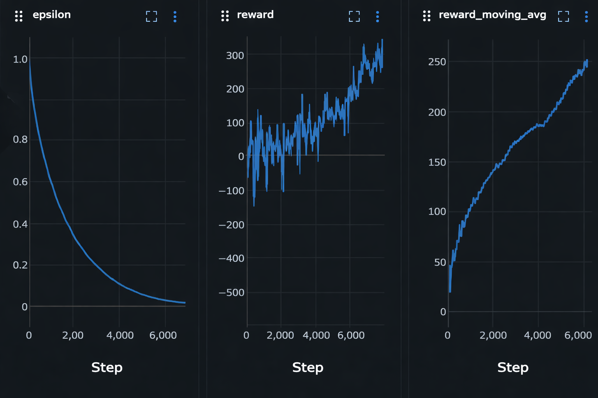

# Lunar Lander

Tabular Q-learning agents for the Gymnasium [LunarLander-v2](https://gymnasium.farama.org/environments/box2d/lunar_lander) environment.

## Highlights
- Tabular Q-learning with observation discretization
- Single-run training and multi-run (multiprocessing) training
- Optional MLflow experiment tracking

## Project Layout
- `src/lunar_lander/agent.py` Q-learning agent
- `src/lunar_lander/configs.py` training and run configs
- `src/lunar_lander/utils/` logging, multiprocessing and file I/O
- `src/run.py` CLI entry point
- `scripts/random_rollout.py` sanity check with a random policy
- `models/` saved Q-tables (policies)

## Setup
Create a virtual environment and install dependencies:
```
uv sync
```

If you use MLflow, start a local server:
```
uv run mlflow server --host 127.0.0.1 --port 8080 --no-serve-artifacts --backend-store-uri ./mlflow
```

## Usage
Quick environment sanity check (random actions):
```
uv run scripts/random_rollout.py
```

Train a single agent:
```
python src/run.py train-single --render
```

Train multiple agents in parallel:
```
python src/run.py train-multi --render
```

Run a saved policy:
```
python src/run.py run --run-id <RUN_ID> --render
```

## Results




## Notes
- Saved policies are stored in `models/<RUN_ID>.pkl`
- For faster training, run without `--render`
